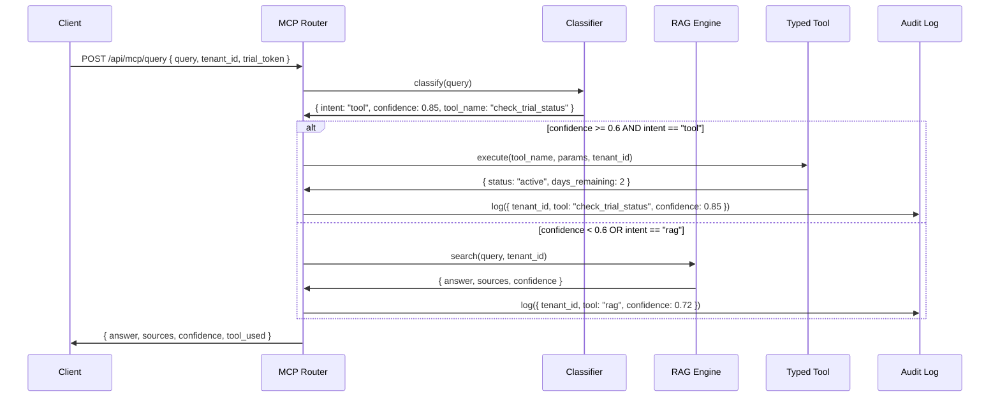

# Enterprise RAG + MCP Implementation Plan
**Project:** Multi-Tenant Chatbot with Secure RAG, MCP Router, and 3-Day Trial Flow  
**Security Model:** Tenant-isolated vector queries, PII masking, RLS enforcement, fail-closed by default  
**Date:** November 10, 2025

---

## Executive Summary

This document provides a complete, security-first implementation plan to finish the RAG pipeline, build a typed Model Control Plane (MCP), implement deterministic tools, and ship a production-ready 3-day trial widget with multi-tenant isolation.

**Non-negotiable security requirements:**
1. Every `pgvector` query MUST include `WHERE tenant_id = $1` or fail
2. No client-side conversation persistence (localStorage/sessionStorage)
3. Multi-tenant Row-Level Security (RLS) enforced at database layer
4. Typed tool interfaces only; LLMs orchestrate, tools execute
5. PII masking, audit logs, rate limits on all LLM calls

---

## 1. Prioritized Implementation Plan

### Epic 1: RAG Security & Supabase Migration (Sprint 1, Week 1)
**Owner:** Backend Engineer + Security  
**Goal:** Replace in-memory RAG with tenant-isolated Supabase pgvector + RLS  
**Tasks:**
- [ ] Create Supabase `embeddings` table with `tenant_id` column and RLS policies
- [ ] Migrate LangChain retriever to use Supabase vector store with mandatory `WHERE tenant_id = $1`
- [ ] Add fail-closed tenant validation middleware (reject requests without tenant context)
- [ ] Write SQL migration script with RLS policies (see Section 3)
- [ ] Unit tests: assert SQL queries always include `tenant_id` filter
- [ ] Integration test: attempt cross-tenant query and verify rejection

**Acceptance Criteria:**
- ✅ All vector queries parameterize `tenant_id`
- ✅ Attempted cross-tenant reads return 0 rows (RLS enforcement)
- ✅ Security test suite validates WHERE clause presence in generated SQL

**Estimated Effort:** 3-4 days

---

### Epic 2: MCP Router + Typed Tools (Sprint 1-2, Week 1-2)
**Owner:** Backend Engineer + ML Engineer  
**Goal:** Build MCP classifier, router, and typed tool registry  
**Tasks:**
- [ ] Implement MCP API routes: `/api/mcp/classify`, `/api/mcp/route`, `/api/mcp/execute`
- [ ] Add confidence scoring logic (classify intent → route to tool or RAG)
- [ ] Define typed tool interfaces with JSON Schema validation (see Section 4)
- [ ] Implement tool stubs: `check_trial_status`, `search_knowledge`, `get_product_info`
- [ ] Add telemetry hooks (tool latency, confidence scores, fallback triggers)
- [ ] Integration tests for each tool + end-to-end MCP flow

**Acceptance Criteria:**
- ✅ MCP routes queries to correct tool based on intent classification
- ✅ Tools return typed JSON responses matching schema
- ✅ Low-confidence queries (<0.6) fallback to RAG instead of guessing
- ✅ Telemetry captures tool execution time and success/failure

**Estimated Effort:** 5-6 days

---

### Epic 3: Guardrails & Security Controls (Sprint 2, Week 2)
**Owner:** Security Engineer + Backend  
**Goal:** PII masking, audit logging, rate limiting, secrets management  
**Tasks:**
- [ ] Implement PII detection middleware (regex + NER for emails, phones, SSNs, credit cards)
- [ ] Add audit log for every RAG query: `{ tenant_id, query_hash, timestamp, tool_used, confidence }`
- [ ] Rate limit expensive LLM calls (OpenAI GPT-4): 10/min per tenant
- [ ] Secrets management: use environment variables + Vault for API keys
- [ ] Add RBAC: trial users limited to 100 queries, paid users unlimited
- [ ] Security test: inject PII and verify it's masked before LLM call

**Acceptance Criteria:**
- ✅ PII patterns masked in logs and LLM inputs
- ✅ Audit log captures every query with tenant context
- ✅ Rate limiter rejects burst requests exceeding threshold
- ✅ Trial token validation prevents expired/invalid tokens

**Estimated Effort:** 3-4 days

---

### Epic 4: Frontend Widget Refinements (Sprint 2, Week 2)
**Owner:** Frontend Engineer  
**Goal:** Sticky header, scroll behavior, auto-close, remove localStorage  
**Tasks:**
- [ ] Remove all `localStorage.setItem('messages', ...)` and `sessionStorage` usage
- [ ] Implement sticky header (always visible at top of widget)
- [ ] Custom scrollbar: visible only when content overflows, hidden otherwise
- [ ] Auto-close on outside click (click event listener on document)
- [ ] Responsive layout: test on mobile (375px), tablet (768px), desktop (1440px)
- [ ] Acceptance tests for each UI behavior

**Acceptance Criteria:**
- ✅ No conversation persistence; page refresh clears chat
- ✅ Sticky header remains visible during scroll
- ✅ Scrollbar appears only when messages exceed viewport height
- ✅ Widget closes when clicking outside container
- ✅ Layout adapts to mobile/tablet/desktop without breaking

**Estimated Effort:** 2-3 days

---

### Epic 5: Trial Onboarding Flow (Sprint 3, Week 3)
**Owner:** Backend + Frontend  
**Goal:** KB upload, crawl, branding config, widget generator  
**Tasks:**
- [ ] Implement `/api/start-trial` with tenant_id generation and RLS setup
- [ ] Add KB upload: PDF/DOCX/TXT file parsing → chunking → embedding
- [ ] Website crawl: sitemap-aware recursive crawler with rate limiting
- [ ] Manual text input: allow paste + manual entries
- [ ] Branding config: logo, colors, assistant name, tone (stored per tenant)
- [ ] Widget code generator: inject trial_token + origin lock
- [ ] Expiration flow: auto-purge embeddings + show upgrade CTA after 72 hours

**Acceptance Criteria:**
- ✅ Trial creates isolated tenant_id and RLS context
- ✅ Ingestion pipeline chunks + embeds uploaded KB
- ✅ Generated widget code includes tenant-specific trial_token
- ✅ Trial expires after 3 days; embeddings purged automatically
- ✅ Upgrade flow prompts user before expiration

**Estimated Effort:** 6-7 days

---

### Epic 6: Security Tests & Acceptance (Sprint 3, Week 3)
**Owner:** QA + Security  
**Goal:** RAG security tests, integration tests, E2E regression  
**Tasks:**
- [ ] Unit tests: validate WHERE clause in every vector query
- [ ] Integration test: attempt cross-tenant access and verify rejection
- [ ] E2E test: trial signup → upload KB → query → verify answer + sources
- [ ] Security checklist: SAST (Semgrep), DAST (OWASP ZAP), secrets scan
- [ ] Regression tests for each tool + MCP flow
- [ ] Load test: 100 concurrent queries per tenant

**Acceptance Criteria:**
- ✅ All tests pass (unit, integration, E2E, security)
- ✅ SAST reports no critical/high vulnerabilities
- ✅ Cross-tenant tests confirm RLS enforcement
- ✅ Load test shows <500ms p95 latency for RAG queries

**Estimated Effort:** 4-5 days

---

### Timeline Summary
| Sprint | Epics | Duration | Owner |
|--------|-------|----------|-------|
| Sprint 1 | RAG Security, MCP Router (partial) | Week 1 | Backend + Security |
| Sprint 2 | MCP Tools, Guardrails, Frontend | Week 2 | Backend + Frontend + Security |
| Sprint 3 | Trial Flow, Security Tests | Week 3 | Full team |

**Total Estimated Duration:** 3 weeks (15 working days)

---

## 2. MCP Skeleton Design

### Architecture Overview
The Model Control Plane (MCP) is a typed routing layer that:
1. **Classifies** incoming queries by intent (RAG search, tool invocation, conversational)
2. **Routes** to appropriate backend (vector search, deterministic tool, or fallback)
3. **Executes** tools with typed inputs/outputs
4. **Logs** telemetry for confidence, latency, and success/failure



### API Endpoints

#### 1. `/api/mcp/classify` (POST)
**Purpose:** Classify query intent  
**Input Schema:**
```json
{
  "type": "object",
  "required": ["query", "tenant_id"],
  "properties": {
    "query": { "type": "string", "minLength": 1 },
    "tenant_id": { "type": "string", "pattern": "^tn_[a-f0-9]{32}$" }
  }
}
```
**Output Schema:**
```json
{
  "type": "object",
  "required": ["intent", "confidence"],
  "properties": {
    "intent": { "enum": ["rag", "tool", "conversational"] },
    "confidence": { "type": "number", "minimum": 0, "maximum": 1 },
    "tool_name": { "type": "string" },
    "tool_params": { "type": "object" }
  }
}
```

#### 2. `/api/mcp/route` (POST)
**Purpose:** Route query to appropriate backend  
**Input Schema:**
```json
{
  "type": "object",
  "required": ["query", "tenant_id", "trial_token"],
  "properties": {
    "query": { "type": "string" },
    "tenant_id": { "type": "string" },
    "trial_token": { "type": "string", "pattern": "^tr_[a-f0-9]{32}$" },
    "history": { "type": "array", "items": { "type": "object" } }
  }
}
```
**Output Schema:**
```json
{
  "type": "object",
  "required": ["answer", "confidence", "tool_used"],
  "properties": {
    "answer": { "type": "string" },
    "sources": { "type": "array", "items": { "type": "object" } },
    "confidence": { "type": "number" },
    "tool_used": { "type": "string" },
    "telemetry": { "type": "object" }
  }
}
```

#### 3. `/api/mcp/execute` (POST)
**Purpose:** Execute typed tool directly (admin/debug only)  
**Input Schema:**
```json
{
  "type": "object",
  "required": ["tool_name", "params", "tenant_id"],
  "properties": {
    "tool_name": { "enum": ["check_trial_status", "search_knowledge", "get_product_info"] },
    "params": { "type": "object" },
    "tenant_id": { "type": "string" }
  }
}
```

### Confidence Thresholds
| Confidence Range | Action | Fallback |
|------------------|--------|----------|
| 0.8 - 1.0 | Execute tool directly | None |
| 0.6 - 0.79 | Execute tool + log low confidence | RAG if tool fails |
| 0.0 - 0.59 | Route to RAG search | None |

### Telemetry Events
```typescript
interface MCPTelemetry {
  tenant_id: string;
  query_hash: string; // SHA-256 of query (PII-free)
  intent: "rag" | "tool" | "conversational";
  confidence: number;
  tool_used: string | null;
  latency_ms: number;
  success: boolean;
  timestamp: string;
}
```

---

## 3. RAG Completion & Supabase pgvector Migration

### Current State (Audit)
- ✅ LangChain installed (`@langchain/core`, `@langchain/openai`)
- ✅ In-memory hybrid search (bag-of-words + cosine similarity)
- ❌ **No tenant isolation** — embeddings are global
- ❌ **No persistent vector store** — data lost on restart
- ❌ **No Supabase integration** — SQL queries not implemented

### Migration Plan

#### Step 1: Create Supabase Tables with RLS

**Table: `embeddings`**
```sql
CREATE TABLE embeddings (
  id UUID PRIMARY KEY DEFAULT gen_random_uuid(),
  tenant_id TEXT NOT NULL,
  chunk_text TEXT NOT NULL,
  embedding_768 VECTOR(768), -- nomic-ai/nomic-embed-text-v1.5 dimensionality
  metadata JSONB DEFAULT '{}',
  created_at TIMESTAMPTZ DEFAULT NOW()
);

-- Create index for fast similarity search per tenant
CREATE INDEX embeddings_tenant_id_idx ON embeddings(tenant_id);
CREATE INDEX embeddings_vector_idx ON embeddings 
  USING ivfflat (embedding vector_cosine_ops) 
  WITH (lists = 100);

-- Enable Row-Level Security
ALTER TABLE embeddings ENABLE ROW LEVEL SECURITY;

-- RLS Policy: Users can only read their tenant's embeddings
CREATE POLICY tenant_isolation_select ON embeddings
  FOR SELECT
  USING (tenant_id = current_setting('app.current_tenant_id', true));

-- RLS Policy: Users can only insert into their tenant
CREATE POLICY tenant_isolation_insert ON embeddings
  FOR INSERT
  WITH CHECK (tenant_id = current_setting('app.current_tenant_id', true));

-- RLS Policy: Users can only delete their tenant's embeddings
CREATE POLICY tenant_isolation_delete ON embeddings
  FOR DELETE
  USING (tenant_id = current_setting('app.current_tenant_id', true));
```

**Table: `trials`**
```sql
CREATE TABLE trials (
  id UUID PRIMARY KEY DEFAULT gen_random_uuid(),
  trial_token TEXT UNIQUE NOT NULL,
  tenant_id TEXT UNIQUE NOT NULL,
  site_origin TEXT NOT NULL,
  admin_email TEXT NOT NULL,
  display_name TEXT NOT NULL,
  theme JSONB DEFAULT '{}',
  status TEXT DEFAULT 'active', -- active | expired | upgraded
  created_at TIMESTAMPTZ DEFAULT NOW(),
  expires_at TIMESTAMPTZ NOT NULL,
  queries_used INT DEFAULT 0,
  queries_limit INT DEFAULT 100
);

CREATE INDEX trials_token_idx ON trials(trial_token);
CREATE INDEX trials_tenant_idx ON trials(tenant_id);

-- RLS for trials (users can only see their trial)
ALTER TABLE trials ENABLE ROW LEVEL SECURITY;

CREATE POLICY trial_isolation ON trials
  FOR SELECT
  USING (tenant_id = current_setting('app.current_tenant_id', true));
```

#### Step 2: LangChain Retriever with Tenant Filter

**File:** `src/lib/rag/supabase-retriever.ts`
```typescript
import { SupabaseVectorStore } from "@langchain/community/vectorstores/supabase";
import { OpenAIEmbeddings } from "@langchain/openai";
import { createClient } from "@supabase/supabase-js";

export async function getSupabaseRetriever(tenantId: string) {
  if (!tenantId || !tenantId.startsWith('tn_')) {
    throw new Error('SECURITY: Invalid tenant_id. Access denied.');
  }

  const supabaseUrl = process.env.SUPABASE_URL;
  const supabaseKey = process.env.SUPABASE_SERVICE_ROLE_KEY;

  if (!supabaseUrl || !supabaseKey) {
    throw new Error('SECURITY: Supabase credentials missing. Access denied.');
  }

  const client = createClient(supabaseUrl, supabaseKey);

  // Set tenant context for RLS enforcement
  await client.rpc('set_config', {
    setting: 'app.current_tenant_id',
    value: tenantId,
  });

  const embeddings = new OpenAIEmbeddings({
    openAIApiKey: process.env.OPENAI_API_KEY,
    modelName: "text-embedding-ada-002",
  });

  const vectorStore = await SupabaseVectorStore.fromExistingIndex(
    embeddings,
    {
      client,
      tableName: "embeddings",
      queryName: "match_embeddings_by_tenant", // Custom function below
    }
  );

  return vectorStore.asRetriever({
    k: 3,
    filter: { tenant_id: tenantId }, // Redundant but safe
  });
}
```

**Supabase Function:** `match_embeddings_by_tenant`
```sql
CREATE OR REPLACE FUNCTION match_embeddings_by_tenant(
  query_embedding VECTOR(768),
  match_tenant_id TEXT,
  match_count INT DEFAULT 5
)
RETURNS TABLE (
  id UUID,
  chunk_text TEXT,
  metadata JSONB,
  similarity FLOAT
)
LANGUAGE plpgsql
AS $$
BEGIN
  -- CRITICAL: Always filter by tenant_id
  IF match_tenant_id IS NULL OR match_tenant_id = '' THEN
    RAISE EXCEPTION 'SECURITY: tenant_id is required';
  END IF;

  RETURN QUERY
  SELECT
    embeddings.id,
    embeddings.chunk_text,
    embeddings.metadata,
    1 - (embeddings.embedding <=> query_embedding) AS similarity
  FROM embeddings
  WHERE embeddings.tenant_id = match_tenant_id -- MANDATORY FILTER
  ORDER BY embeddings.embedding <=> query_embedding
  LIMIT match_count;
END;
$$;
```

#### Step 3: Fail-Closed Tenant Validation Middleware

**File:** `src/lib/middleware/tenant-context.ts`
```typescript
import { NextRequest, NextResponse } from 'next/server';

export async function validateTenantContext(request: NextRequest) {
  const body = await request.json();
  const { tenant_id, trial_token } = body;

  // Fail closed: reject if tenant context missing
  if (!tenant_id || !tenant_id.startsWith('tn_')) {
    return NextResponse.json(
      { error: 'SECURITY: Invalid tenant context. Access denied.' },
      { status: 403 }
    );
  }

  // Validate trial token matches tenant
  if (trial_token) {
    const isValid = await validateTrialToken(trial_token, tenant_id);
    if (!isValid) {
      return NextResponse.json(
        { error: 'SECURITY: Invalid trial token. Access denied.' },
        { status: 403 }
      );
    }
  }

  return null; // Validation passed
}

async function validateTrialToken(token: string, tenantId: string): Promise<boolean> {
  // Query trials table with RLS enforcement
  const client = createSupabaseClient();
  await client.rpc('set_config', {
    setting: 'app.current_tenant_id',
    value: tenantId,
  });

  const { data, error } = await client
    .from('trials')
    .select('tenant_id, expires_at')
    .eq('trial_token', token)
    .eq('tenant_id', tenantId) // Explicit filter
    .single();

  if (error || !data) return false;
  if (new Date(data.expires_at) < new Date()) return false; // Expired

  return true;
}
```

### RAG Completion Checklist
- [ ] Supabase project created with `pgvector` extension enabled
- [ ] Tables `embeddings` and `trials` created with RLS policies
- [ ] Custom function `match_embeddings_by_tenant` deployed
- [ ] LangChain retriever updated to use Supabase with tenant filter
- [ ] Middleware added to validate tenant context on every request
- [ ] Unit test: assert SQL queries include `WHERE tenant_id = $1`
- [ ] Integration test: attempt cross-tenant read and verify 0 results
- [ ] Migration script tested in staging environment

---

## 4. Typed Tool Interface Definitions

All tools return deterministic, typed JSON responses. LLMs orchestrate tool selection; tools execute business logic.

### Tool 1: `check_trial_status`
**Purpose:** Check trial expiration and usage limits  
**Input Schema:**
```json
{
  "type": "object",
  "required": ["trial_token", "tenant_id"],
  "properties": {
    "trial_token": { "type": "string", "pattern": "^tr_[a-f0-9]{32}$" },
    "tenant_id": { "type": "string", "pattern": "^tn_[a-f0-9]{32}$" }
  }
}
```
**Output Schema:**
```json
{
  "type": "object",
  "required": ["status", "expires_at", "queries_used", "queries_remaining"],
  "properties": {
    "status": { "enum": ["active", "expired", "upgraded"] },
    "expires_at": { "type": "string", "format": "date-time" },
    "queries_used": { "type": "integer", "minimum": 0 },
    "queries_remaining": { "type": "integer", "minimum": 0 },
    "days_remaining": { "type": "number" }
  }
}
```
**Example Response:**
```json
{
  "status": "active",
  "expires_at": "2025-11-13T14:30:00Z",
  "queries_used": 23,
  "queries_remaining": 77,
  "days_remaining": 2.1
}
```
**Side Effects:** None (read-only)

---

### Tool 2: `search_knowledge`
**Purpose:** RAG search with tenant-isolated vector store  
**Input Schema:**
```json
{
  "type": "object",
  "required": ["query", "tenant_id"],
  "properties": {
    "query": { "type": "string", "minLength": 1 },
    "tenant_id": { "type": "string" },
    "top_k": { "type": "integer", "default": 3, "minimum": 1, "maximum": 10 }
  }
}
```
**Output Schema:**
```json
{
  "type": "object",
  "required": ["answer", "sources", "confidence"],
  "properties": {
    "answer": { "type": "string" },
    "sources": {
      "type": "array",
      "items": {
        "type": "object",
        "properties": {
          "chunk_text": { "type": "string" },
          "metadata": { "type": "object" },
          "similarity": { "type": "number" }
        }
      }
    },
    "confidence": { "type": "number", "minimum": 0, "maximum": 1 }
  }
}
```
**Example Response:**
```json
{
  "answer": "BiTB Service Desk supports 5k queries per month across 3 active trials.",
  "sources": [
    {
      "chunk_text": "BiTB Service Desk is built for agencies...",
      "metadata": { "source": "https://bitb.ltd/subscription/service", "title": "Service Desk Plan" },
      "similarity": 0.87
    }
  ],
  "confidence": 0.85
}
```
**Side Effects:** Increments `queries_used` counter for trial

---

### Tool 3: `get_product_info`
**Purpose:** Fetch product details for ecommerce queries  
**Input Schema:**
```json
{
  "type": "object",
  "required": ["product_id", "tenant_id"],
  "properties": {
    "product_id": { "type": "string" },
    "tenant_id": { "type": "string" }
  }
}
```
**Output Schema:**
```json
{
  "type": "object",
  "required": ["product_id", "name", "price", "in_stock"],
  "properties": {
    "product_id": { "type": "string" },
    "name": { "type": "string" },
    "price": { "type": "number" },
    "currency": { "type": "string", "default": "USD" },
    "in_stock": { "type": "boolean" },
    "variants": { "type": "array" },
    "shipping_info": { "type": "object" }
  }
}
```
**Example Response:**
```json
{
  "product_id": "prod_123",
  "name": "Men's Running Shoes - Size 10",
  "price": 89.99,
  "currency": "USD",
  "in_stock": true,
  "variants": [
    { "size": "9", "in_stock": false },
    { "size": "10", "in_stock": true }
  ],
  "shipping_info": { "delivery_days": 3, "free_shipping_threshold": 50 }
}
```
**Side Effects:** None (read-only from product catalog)

---

### Tool 4: `start_ingestion`
**Purpose:** Trigger KB ingestion job (upload/crawl/manual)  
**Input Schema:**
```json
{
  "type": "object",
  "required": ["tenant_id", "data_source"],
  "properties": {
    "tenant_id": { "type": "string" },
    "data_source": {
      "type": "object",
      "properties": {
        "type": { "enum": ["upload", "crawl", "manual"] },
        "files": { "type": "array" },
        "urls": { "type": "array" },
        "text": { "type": "string" }
      }
    }
  }
}
```
**Output Schema:**
```json
{
  "type": "object",
  "required": ["job_id", "status"],
  "properties": {
    "job_id": { "type": "string" },
    "status": { "enum": ["queued", "processing", "completed", "failed"] },
    "estimated_completion": { "type": "string", "format": "date-time" }
  }
}
```
**Side Effects:** Enqueues ingestion job, writes to `embeddings` table

---

## 5. Guardrails & Security Controls

### 5.1 PII Masking
**Implementation:** Middleware intercepts all LLM inputs and masks PII patterns before sending to OpenAI/Anthropic.

**File:** `src/lib/middleware/pii-masking.ts`
```typescript
const PII_PATTERNS = {
  email: /\b[A-Za-z0-9._%+-]+@[A-Za-z0-9.-]+\.[A-Z|a-z]{2,}\b/g,
  phone: /\b\d{3}[-.]?\d{3}[-.]?\d{4}\b/g,
  ssn: /\b\d{3}-\d{2}-\d{4}\b/g,
  credit_card: /\b\d{4}[\s-]?\d{4}[\s-]?\d{4}[\s-]?\d{4}\b/g,
};

export function maskPII(text: string): string {
  let masked = text;
  masked = masked.replace(PII_PATTERNS.email, '[EMAIL_REDACTED]');
  masked = masked.replace(PII_PATTERNS.phone, '[PHONE_REDACTED]');
  masked = masked.replace(PII_PATTERNS.ssn, '[SSN_REDACTED]');
  masked = masked.replace(PII_PATTERNS.credit_card, '[CARD_REDACTED]');
  return masked;
}
```

**Test:**
```typescript
it('masks PII in user queries', () => {
  const input = 'My email is john@example.com and phone is 555-123-4567';
  const output = maskPII(input);
  expect(output).toBe('My email is [EMAIL_REDACTED] and phone is [PHONE_REDACTED]');
});
```

---

### 5.2 Audit Logging
**Implementation:** Every RAG query logged to Supabase `audit_logs` table.

**Table Schema:**
```sql
CREATE TABLE audit_logs (
  id UUID PRIMARY KEY DEFAULT gen_random_uuid(),
  tenant_id TEXT NOT NULL,
  query_hash TEXT NOT NULL, -- SHA-256 of query (no plaintext)
  tool_used TEXT,
  confidence FLOAT,
  latency_ms INT,
  success BOOLEAN,
  error_message TEXT,
  timestamp TIMESTAMPTZ DEFAULT NOW()
);

CREATE INDEX audit_logs_tenant_idx ON audit_logs(tenant_id, timestamp DESC);
```

**Logging Function:**
```typescript
import crypto from 'crypto';

export async function logQuery(params: {
  tenant_id: string;
  query: string;
  tool_used: string;
  confidence: number;
  latency_ms: number;
  success: boolean;
  error_message?: string;
}) {
  const query_hash = crypto.createHash('sha256').update(params.query).digest('hex');

  await supabase.from('audit_logs').insert({
    tenant_id: params.tenant_id,
    query_hash,
    tool_used: params.tool_used,
    confidence: params.confidence,
    latency_ms: params.latency_ms,
    success: params.success,
    error_message: params.error_message,
  });
}
```

---

### 5.3 Rate Limiting
**Implementation:** Redis-based rate limiter per tenant.

**File:** `src/lib/middleware/rate-limiter.ts`
```typescript
import { Redis } from 'ioredis';

const redis = new Redis(process.env.REDIS_URL);

export async function checkRateLimit(tenant_id: string): Promise<boolean> {
  const key = `rate_limit:${tenant_id}`;
  const limit = 10; // 10 requests per minute
  const window = 60; // 60 seconds

  const current = await redis.incr(key);
  if (current === 1) {
    await redis.expire(key, window);
  }

  return current <= limit;
}
```

**Middleware:**
```typescript
export async function rateLimitMiddleware(req: NextRequest) {
  const { tenant_id } = await req.json();
  const allowed = await checkRateLimit(tenant_id);

  if (!allowed) {
    return NextResponse.json(
      { error: 'Rate limit exceeded. Try again in 60 seconds.' },
      { status: 429 }
    );
  }

  return null;
}
```

---

### 5.4 Secrets Management
**Best Practices:**
- Store API keys in environment variables (`.env.local`)
- Use HashiCorp Vault or AWS Secrets Manager for production
- Rotate keys quarterly
- Never commit secrets to Git

**Environment Variables Required:**
```bash
# .env.local
OPENAI_API_KEY=sk-...
SUPABASE_URL=https://xxx.supabase.co
SUPABASE_SERVICE_ROLE_KEY=eyJ...
REDIS_URL=redis://localhost:6379
NEXT_PUBLIC_WIDGET_URL=https://bitb.ltd
```

---

### 5.5 RBAC (Role-Based Access Control)
**Roles:**
- `trial`: 100 queries, 3-day expiration, limited tools
- `service`: 5k queries/month, full tools, no expiration
- `commerce`: 10k queries/month, product catalog access
- `enterprise`: unlimited, custom LLM endpoints, audit access

**Enforcement:**
```typescript
export function checkRBAC(tenant: { role: string; queries_used: number; queries_limit: number }) {
  if (tenant.role === 'trial' && tenant.queries_used >= tenant.queries_limit) {
    throw new Error('Query limit exceeded. Please upgrade.');
  }
  return true;
}
```

---

### 5.6 SAST/DAST Integration
**Tools:**
- **SAST:** Semgrep (detect hardcoded secrets, SQL injection)
- **DAST:** OWASP ZAP (scan running app for vulnerabilities)
- **Secrets Scan:** TruffleHog (pre-commit hook)

**CI/CD Pipeline:**
```yaml
# .github/workflows/security.yml
name: Security Scan
on: [push, pull_request]
jobs:
  sast:
    runs-on: ubuntu-latest
    steps:
      - uses: actions/checkout@v3
      - run: semgrep --config=auto .
  dast:
    runs-on: ubuntu-latest
    steps:
      - run: docker run -t owasp/zap2docker-stable zap-baseline.py -t https://bitb.ltd
```

---

## 6. Frontend Widget Specification

### UI Behavior Requirements

#### 6.1 Sticky Header
- Header remains visible at top of widget during scroll
- Contains: logo, assistant name, minimize/close buttons, mute/replay controls
- CSS: `position: sticky; top: 0; z-index: 10;`

#### 6.2 Scroll Behavior
- Content scrolls only when messages exceed viewport height
- Custom scrollbar visible only when overflow occurs
- CSS:
  ```css
  .scroll-area {
    overflow-y: auto;
    max-height: calc(100vh - 200px);
  }
  .scroll-area::-webkit-scrollbar {
    width: 6px;
    display: none; /* Hidden by default */
  }
  .scroll-area:hover::-webkit-scrollbar {
    display: block; /* Show on hover */
  }
  ```

#### 6.3 Auto-Close on Outside Click
- Widget closes when user clicks outside container
- Implementation:
  ```typescript
  useEffect(() => {
    const handleClickOutside = (event: MouseEvent) => {
      if (isOpen && widgetRef.current && !widgetRef.current.contains(event.target as Node)) {
        setIsOpen(false);
      }
    };
    document.addEventListener('mousedown', handleClickOutside);
    return () => document.removeEventListener('mousedown', handleClickOutside);
  }, [isOpen]);
  ```

#### 6.4 Responsive Layout
| Breakpoint | Width | Height | Layout |
|------------|-------|--------|--------|
| Mobile (<640px) | 90vw | 80vh | Single column, compact header |
| Tablet (640-1024px) | 500px | 600px | Standard layout |
| Desktop (>1024px) | 500px | 600px | Standard layout |

#### 6.5 No Client-Side Persistence
- Remove all `localStorage.setItem('messages', ...)` calls
- Remove `sessionStorage` usage
- Page refresh clears chat history
- Only persist: mute state (`bitb_voice_muted`), greeted flag (`bitb_greeted`)

---

### Acceptance Tests

**Test 1: Sticky Header**
```typescript
it('keeps header visible during scroll', async () => {
  render(<ChatbotWidget />);
  const header = screen.getByTestId('widget-header');
  const scrollArea = screen.getByTestId('scroll-area');
  
  // Scroll to bottom
  fireEvent.scroll(scrollArea, { target: { scrollTop: 1000 } });
  
  // Header should still be visible
  expect(header).toBeInTheDocument();
  expect(getComputedStyle(header).position).toBe('sticky');
});
```

**Test 2: Auto-Close**
```typescript
it('closes widget when clicking outside', async () => {
  render(<ChatbotWidget />);
  const openButton = screen.getByLabelText('Open BiTB Assistant');
  fireEvent.click(openButton);
  
  expect(screen.getByTestId('widget-container')).toBeVisible();
  
  // Click outside
  fireEvent.mouseDown(document.body);
  
  expect(screen.queryByTestId('widget-container')).not.toBeInTheDocument();
});
```

**Test 3: No Persistence**
```typescript
it('does not persist messages in localStorage', () => {
  render(<ChatbotWidget />);
  const input = screen.getByPlaceholderText('Type your message...');
  fireEvent.change(input, { target: { value: 'Hello' } });
  fireEvent.click(screen.getByLabelText('Send message'));
  
  expect(localStorage.getItem('messages')).toBeNull();
  expect(sessionStorage.getItem('messages')).toBeNull();
});
```

---

### Sample Embed Flow

**Step 1: User signs up for trial**
- Navigate to `https://bitb.ltd/trial`
- Fill form: site origin, email, display name, data source
- Submit → backend creates `tenant_id`, `trial_token`, and RLS context

**Step 2: Backend generates widget code**
```typescript
const widgetCode = `
<!-- BiTB Chat Widget -->
<script>
  window.BitBConfig = {
    trialToken: '${trial_token}',
    tenantId: '${tenant_id}',
    theme: 'auto',
    origin: '${site_origin}'
  };
</script>
<script src="https://bitb.ltd/bitb-widget.js" defer></script>
`;
```

**Step 3: User embeds code in their site**
- Paste into `<head>` or before `</body>`
- Widget appears on page load

**Step 4: Widget validates origin lock**
```typescript
// Inside bitb-widget.js
if (window.location.origin !== window.BitBConfig.origin) {
  console.error('BiTB: Origin mismatch. Widget blocked.');
  return;
}
```

---

## 7. Trial Onboarding Flow

### User Journey
1. **Landing Page** → Click "Start Free Trial"
2. **Form:** Enter site origin, email, assistant name, tone
3. **Data Source:** Upload files OR crawl website OR paste text
4. **Branding:** Logo, colors, greeting message
5. **Processing:** Backend ingests KB, generates embeddings
6. **Widget Code:** Copy embed code + instructions
7. **Expiration:** 72 hours countdown, upgrade CTA before expiration

---

### Backend APIs

#### 1. `POST /api/start-trial`
**Input:**
```json
{
  "site_origin": "https://example.com",
  "admin_email": "admin@example.com",
  "display_name": "Example Assistant",
  "theme": { "theme": "auto", "brandColor": "#000000" },
  "data_source": { "type": "crawl", "urls": ["https://example.com"] }
}
```
**Process:**
1. Generate `tenant_id` (e.g., `tn_abc123...`)
2. Generate `trial_token` (e.g., `tr_def456...`)
3. Create RLS context: set `app.current_tenant_id = tenant_id`
4. Insert trial record in `trials` table
5. Enqueue ingestion job
6. Return trial details + embed code

**Output:**
```json
{
  "success": true,
  "tenant_id": "tn_abc123...",
  "trial_token": "tr_def456...",
  "expires_at": "2025-11-13T14:30:00Z",
  "embed_code": "<script>...</script>",
  "ingestion_job_id": "job_789"
}
```

---

#### 2. `POST /api/ingest`
**Input:**
```json
{
  "tenant_id": "tn_abc123...",
  "trial_token": "tr_def456...",
  "data_source": {
    "type": "upload",
    "files": [{ "name": "guide.pdf", "size": 102400, "content_base64": "..." }]
  }
}
```
**Process:**
1. Validate tenant + trial token
2. Parse files (PDF → text via `pdfplumber`, DOCX → text via `mammoth`)
3. Chunk text (800 tokens, 120 overlap)
4. Generate embeddings (OpenAI `text-embedding-ada-002`)
5. Insert into `embeddings` table with `WHERE tenant_id = $1`
6. Return job status

**Output:**
```json
{
  "job_id": "job_789",
  "status": "processing",
  "chunks_processed": 42,
  "estimated_completion": "2025-11-10T15:00:00Z"
}
```

---

#### 3. `GET /api/ingest/status/:job_id`
**Output:**
```json
{
  "job_id": "job_789",
  "status": "completed",
  "chunks_processed": 42,
  "chunks_total": 42,
  "completed_at": "2025-11-10T14:45:00Z"
}
```

---

#### 4. `POST /api/check-trial`
**Input:**
```json
{
  "trial_token": "tr_def456...",
  "tenant_id": "tn_abc123..."
}
```
**Output:**
```json
{
  "valid": true,
  "status": "active",
  "days_remaining": 2.5,
  "queries_used": 23,
  "queries_remaining": 77,
  "expires_at": "2025-11-13T14:30:00Z"
}
```

---

### Expiration & Upgrade Flow

**72 Hours Before Expiration:**
- Send email reminder with upgrade link
- Show in-widget banner: "Trial expires in X days. [Upgrade Now]"

**On Expiration:**
- Set `status = 'expired'` in `trials` table
- Schedule background job to purge embeddings:
  ```sql
  DELETE FROM embeddings WHERE tenant_id = 'tn_abc123...';
  ```
- Widget shows: "Trial expired. [Upgrade to continue]"

**Upgrade Flow:**
- User clicks upgrade → redirect to Stripe checkout
- On payment success → webhook updates `status = 'upgraded'`
- Embeddings remain, queries_limit increased

---

## 8. Acceptance Criteria & Security Tests

### Unit Tests

**Test 1: RAG Security (WHERE Clause Enforcement)**
```typescript
it('enforces tenant_id filter in vector queries', async () => {
  const retriever = await getSupabaseRetriever('tn_test123');
  const query = 'What is BiTB Service Desk?';
  
  // Spy on Supabase query
  const spy = vi.spyOn(supabase, 'rpc');
  
  await retriever.getRelevantDocuments(query);
  
  // Assert query includes tenant filter
  expect(spy).toHaveBeenCalledWith('match_embeddings_by_tenant', {
    query_embedding: expect.any(Array),
    match_tenant_id: 'tn_test123', // MANDATORY
    match_count: 3,
  });
});
```

**Test 2: Cross-Tenant Isolation**
```typescript
it('prevents cross-tenant data access', async () => {
  // Insert embeddings for tenant A
  await insertEmbedding({ tenant_id: 'tn_A', chunk_text: 'Secret A' });
  
  // Query as tenant B
  const retriever = await getSupabaseRetriever('tn_B');
  const results = await retriever.getRelevantDocuments('Secret');
  
  // Assert tenant B sees zero results
  expect(results).toHaveLength(0);
});
```

**Test 3: PII Masking**
```typescript
it('masks PII before LLM call', async () => {
  const input = 'My SSN is 123-45-6789';
  const masked = maskPII(input);
  
  expect(masked).not.toContain('123-45-6789');
  expect(masked).toContain('[SSN_REDACTED]');
});
```

---

### Integration Tests

**Test 1: End-to-End Trial Flow**
```typescript
it('completes trial signup → ingest → query → upgrade', async () => {
  // Step 1: Start trial
  const { trial_token, tenant_id } = await POST('/api/start-trial', {
    site_origin: 'https://test.com',
    admin_email: 'test@test.com',
    display_name: 'Test Bot',
  });
  
  // Step 2: Ingest KB
  const { job_id } = await POST('/api/ingest', {
    tenant_id,
    trial_token,
    data_source: { type: 'manual', text: 'Test content' },
  });
  
  // Wait for ingestion
  await waitForJobCompletion(job_id);
  
  // Step 3: Query
  const { answer } = await POST('/api/mcp/route', {
    tenant_id,
    trial_token,
    query: 'What is the test content?',
  });
  
  expect(answer).toContain('Test content');
  
  // Step 4: Verify expiration
  const { valid } = await POST('/api/check-trial', { trial_token, tenant_id });
  expect(valid).toBe(true);
});
```

---

### Security Tests

**Test 1: SQL Injection Prevention**
```typescript
it('prevents SQL injection in tenant_id', async () => {
  const maliciousTenantId = "'; DROP TABLE embeddings; --";
  
  await expect(
    getSupabaseRetriever(maliciousTenantId)
  ).rejects.toThrow('Invalid tenant_id');
});
```

**Test 2: Rate Limiting**
```typescript
it('enforces rate limits per tenant', async () => {
  const tenant_id = 'tn_test';
  
  // Make 10 requests (allowed)
  for (let i = 0; i < 10; i++) {
    const res = await POST('/api/mcp/route', { tenant_id, query: 'test' });
    expect(res.status).toBe(200);
  }
  
  // 11th request should be rate limited
  const res = await POST('/api/mcp/route', { tenant_id, query: 'test' });
  expect(res.status).toBe(429);
});
```

---

### Load Tests

**Test: 100 Concurrent Queries**
```bash
# Use Apache Bench or k6
k6 run --vus 100 --duration 30s load-test.js
```

**Expected Results:**
- p50 latency: <300ms
- p95 latency: <500ms
- p99 latency: <1000ms
- Error rate: <0.1%

---

## 9. Code Snippets

### LangChain Retriever with Tenant Filter
```typescript
// src/lib/rag/supabase-retriever.ts
import { SupabaseVectorStore } from "@langchain/community/vectorstores/supabase";
import { OpenAIEmbeddings } from "@langchain/openai";
import { createClient } from "@supabase/supabase-js";

export async function getSupabaseRetriever(tenantId: string) {
  if (!tenantId?.startsWith('tn_')) {
    throw new Error('SECURITY: Invalid tenant_id');
  }

  const client = createClient(
    process.env.SUPABASE_URL!,
    process.env.SUPABASE_SERVICE_ROLE_KEY!
  );

  // Set RLS context
  await client.rpc('set_config', {
    setting: 'app.current_tenant_id',
    value: tenantId,
  });

  const embeddings = new OpenAIEmbeddings();
  const vectorStore = await SupabaseVectorStore.fromExistingIndex(embeddings, {
    client,
    tableName: "embeddings",
    queryName: "match_embeddings_by_tenant",
  });

  return vectorStore.asRetriever({ k: 3 });
}
```

---

### MCP Router (Pseudo-code)
```typescript
// src/app/api/mcp/route/route.ts
export async function POST(req: NextRequest) {
  const { query, tenant_id, trial_token } = await req.json();

  // Validate tenant
  const validationError = await validateTenantContext(req);
  if (validationError) return validationError;

  // Classify intent
  const { intent, confidence, tool_name } = await classifyIntent(query);

  let result;
  if (confidence >= 0.6 && intent === 'tool') {
    // Route to typed tool
    result = await executeTool(tool_name, { query, tenant_id });
  } else {
    // Fallback to RAG
    const retriever = await getSupabaseRetriever(tenant_id);
    result = await retriever.getRelevantDocuments(query);
  }

  // Log query
  await logQuery({ tenant_id, query, tool_used: tool_name || 'rag', confidence });

  return NextResponse.json(result);
}
```

---

### Supabase Parameterized Query
```sql
-- Function: match_embeddings_by_tenant
CREATE OR REPLACE FUNCTION match_embeddings_by_tenant(
  query_embedding VECTOR(768),
  match_tenant_id TEXT,
  match_count INT DEFAULT 5
)
RETURNS TABLE (id UUID, chunk_text TEXT, similarity FLOAT)
LANGUAGE plpgsql
AS $$
BEGIN
  -- FAIL CLOSED: Reject if tenant_id missing
  IF match_tenant_id IS NULL THEN
    RAISE EXCEPTION 'tenant_id required';
  END IF;

  RETURN QUERY
  SELECT
    e.id,
    e.chunk_text,
    1 - (e.embedding <=> query_embedding) AS similarity
  FROM embeddings e
  WHERE e.tenant_id = match_tenant_id -- MANDATORY FILTER
  ORDER BY e.embedding <=> query_embedding
  LIMIT match_count;
END;
$$;
```

---

## 10. Summary & Next Steps

### Completed Audit (Current State)
✅ LangChain installed  
✅ In-memory hybrid search working  
✅ Trial API routes stubbed  
❌ No Supabase integration  
❌ No tenant isolation (security gap)  
❌ No persistent vector store  
❌ MCP not implemented  

### Critical Path (3 Weeks)
1. **Week 1:** RAG Security + Supabase migration + MCP skeleton
2. **Week 2:** Typed tools + guardrails + frontend refinements
3. **Week 3:** Trial onboarding + security tests + deployment

### Security Checklist (Must Complete Before Production)
- [ ] RLS policies enabled on `embeddings` and `trials` tables
- [ ] Every vector query includes `WHERE tenant_id = $1`
- [ ] PII masking middleware deployed
- [ ] Audit logging captures all queries
- [ ] Rate limiting enforced per tenant
- [ ] SAST/DAST scans passing
- [ ] Cross-tenant access tests passing
- [ ] Secrets rotated and stored in Vault
- [ ] Trial expiration job tested
- [ ] Widget origin lock enforced

### Deployment Readiness
- [ ] Supabase project provisioned
- [ ] Redis instance for rate limiting
- [ ] OpenAI API key secured
- [ ] Environment variables set
- [ ] CI/CD pipeline configured
- [ ] Monitoring + alerting (Sentry, Datadog)
- [ ] Load testing completed (100 concurrent users)
- [ ] Backup + disaster recovery plan documented

---

## Contact & Support
For questions about this plan, contact:
- **Security:** security@bitb.ltd
- **Engineering:** eng@bitb.ltd
- **PM:** pm@bitb.ltd

---

**Document Version:** 1.0  
**Last Updated:** November 10, 2025  
**Status:** DRAFT — Pending Security Review
