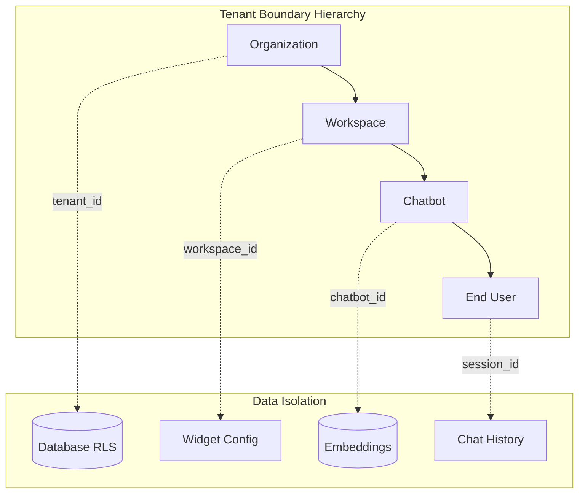
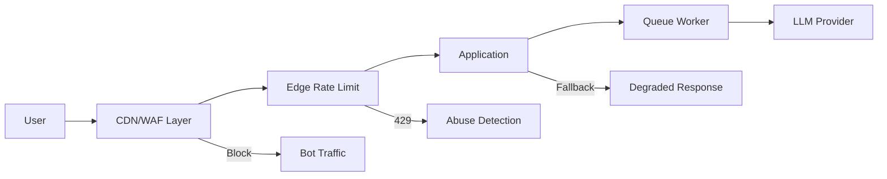
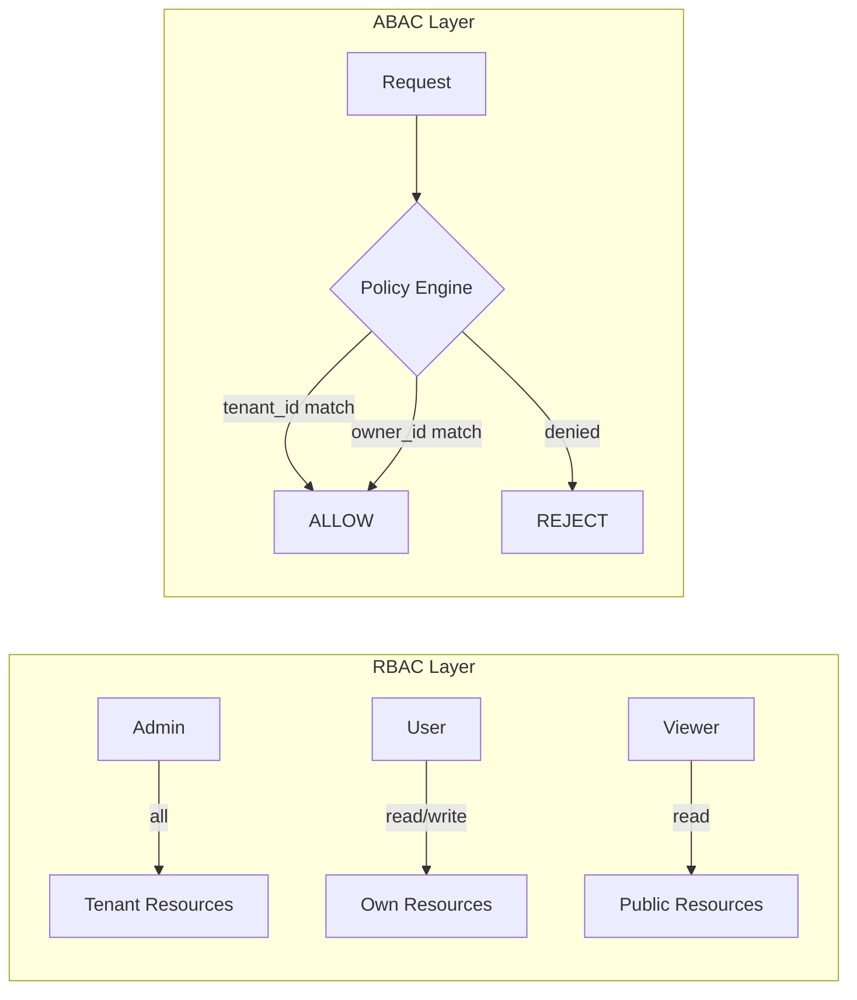
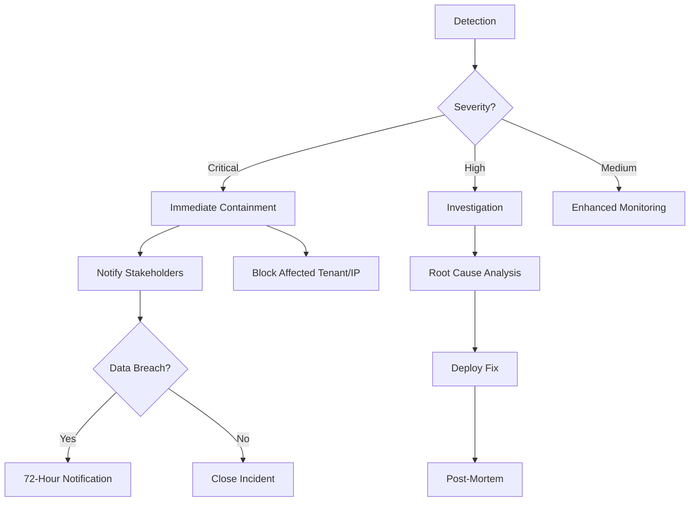
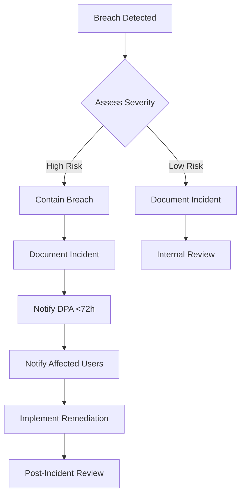

# Security & GDPR Hardening Master Document

**Version**: 1.0.0  
**Status**: Production Ready  
**Compliance Framework**: SOC-2 Type II, ISO-27001, GDPR  
**Last Updated**: 2025-12-22

---

## Table of Contents

1. [Multi-Tenant Threat Model](#1-multi-tenant-threat-model)
2. [DDoS & Abuse Protection](#2-ddos--abuse-protection)
3. [Input Validation & Prompt Safety](#3-input-validation--prompt-safety)
4. [SQL Injection & Data Layer Security](#4-sql-injection--data-layer-security)
5. [Authentication, Authorization & Tenant Isolation](#5-authentication-authorization--tenant-isolation)
6. [API & Integration Security](#6-api--integration-security)
7. [Logging, Monitoring & Incident Response](#7-logging-monitoring--incident-response)
8. [GDPR Compliance](#8-gdpr-compliance)
9. [Production Readiness Checklist](#9-production-readiness-checklist)
10. [SOC-2 / ISO-27001 Control Mapping](#10-soc-2--iso-27001-control-mapping)

---

## 1. Multi-Tenant Threat Model

### 1.1 Tenant Boundaries



| Boundary | ID Format | Isolation Mechanism | Enforcement Layer |
|----------|-----------|---------------------|-------------------|
| Organization | `org_[uuid]` | Database-level RLS | PostgreSQL |
| Workspace | `ws_[uuid]` | Schema isolation | Application + RLS |
| Chatbot | `tn_[32hex]` | Tenant ID filter | API + Vector DB |
| End User | `sess_[uuid]` | Session scoping | Application |

### 1.2 Attack Surfaces

#### Public Attack Surfaces (Exposed to Internet)

| Surface | Endpoint/Component | Risk Level | Attack Vectors |
|---------|-------------------|------------|----------------|
| Widget Embed | `widget.js`, `/api/widget/*` | 🔴 Critical | DDoS, XSS, CSRF, abuse |
| Chat API | `/api/chat/ask` | 🔴 Critical | Prompt injection, abuse |
| Document Upload | `/api/trial/ingest` | 🟠 High | Malicious files, XPIA |
| Webhook Receivers | `/api/webhooks/*` | 🟠 High | Replay attacks, spoofing |
| Public Landing | `/`, marketing pages | 🟡 Medium | SEO spam, scraping |

#### Internal Attack Vectors

| Vector | Description | Risk Level | Mitigation Status |
|--------|-------------|------------|-------------------|
| Misconfigured RAG | Wrong tenant_id in retrieval | 🔴 Critical | ✅ RLS + Guard |
| Prompt Injection | User input hijacks system prompt | 🔴 Critical | ✅ 99%+ detection |
| XPIA (Cross-Prompt) | Malicious docs poison context | 🔴 Critical | ✅ Sanitization |
| Privilege Escalation | User accesses admin functions | 🟠 High | ⚠️ RBAC needed |
| Session Hijacking | Stolen/forged session tokens | 🟠 High | ⚠️ JWT hardening |

### 1.3 AI-Specific Risks

| Risk | STRIDE Category | Impact | Detection Rate |
|------|----------------|--------|----------------|
| Jailbreak (DAN, roleplay) | Tampering | Complete bypass | 99%+ |
| Direct Prompt Injection | Tampering | Partial bypass | 95%+ |
| XPIA via Documents | Information Disclosure | Data leakage | 99%+ |
| PII Exfiltration via Response | Information Disclosure | GDPR violation | ✅ Redaction |
| Multi-turn Manipulation | Elevation of Privilege | Accumulated bypass | 95%+ |
| Data Exfiltration via Responses | Information Disclosure | Cross-tenant leak | ✅ Output filtering |

> [!IMPORTANT]
> All AI-specific risks are covered by the red-team test suite (21 tests). See [redteam/THREAT_MODEL.md](file:///w:/BIT%20B%20RAG%20CAHTBOT/redteam/THREAT_MODEL.md).

---

## 2. DDoS & Abuse Protection

### 2.1 Widget-First Defense Architecture



### 2.2 Required Controls

| Layer | Control | Implementation | Status |
|-------|---------|----------------|--------|
| **Layer 3/4** | CDN DDoS protection | Cloudflare/AWS Shield | ⚠️ Deploy |
| **Layer 7** | WAF rules | OWASP CRS, custom rules | ⚠️ Deploy |
| **Edge** | IP rate limiting | 100 req/min/IP | ⚠️ Configure |
| **App** | Per-tenant rate limit | Redis sliding window | ✅ Implemented |
| **App** | Per-bot rate limit | chatbot_id scoped | ⚠️ Add |
| **App** | Per-IP rate limit | IP + tenant compound | ⚠️ Add |
| **Queue** | Backpressure | BullMQ concurrency | ✅ Implemented |
| **LLM** | Provider rate limit | Token bucket | ⚠️ Add |

### 2.3 Rate Limit Configuration

```typescript
// Production Rate Limits - src/config/rate-limits.ts
export const RATE_LIMITS = {
  // Per-tenant limits (by plan tier)
  tenant: {
    trial:    { window: '1m', max: 10,   burst: 15 },
    starter:  { window: '1m', max: 30,   burst: 50 },
    growth:   { window: '1m', max: 100,  burst: 150 },
    scale:    { window: '1m', max: 500,  burst: 750 },
  },
  
  // Per-widget (public embed)
  widget: {
    perIP:     { window: '1m', max: 20,  burst: 30 },
    perSession: { window: '1m', max: 10,  burst: 15 },
  },
  
  // Ingestion (document upload)
  ingestion: {
    perTenant: { window: '1h', max: 100, burst: 150 },
    perFile:   { maxSize: '10MB', allowedTypes: ['pdf', 'txt', 'md', 'docx'] },
  },
  
  // API keys
  api: {
    perKey:    { window: '1m', max: 60,  burst: 100 },
  },
};
```

### 2.4 Bot Detection & Fingerprinting

| Technique | Purpose | Implementation |
|-----------|---------|----------------|
| Device fingerprint | Identify unique clients | FingerprintJS Pro |
| Behavior analysis | Detect automation patterns | Request timing variance |
| CAPTCHA escalation | Block confirmed bots | hCaptcha (soft → hard) |
| Honeypot fields | Detect form bots | Hidden input fields |
| JavaScript challenge | Block non-JS clients | Widget bootstrap check |

### 2.5 Challenge Escalation Pipeline

```
Request → [Fingerprint Check]
              │
              ├─ Clean → Allow
              │
              └─ Suspicious → [Soft Challenge]
                                   │
                                   ├─ Pass → Allow (monitored)
                                   │
                                   └─ Fail → [Hard Challenge]
                                                  │
                                                  ├─ Pass → Allow (rate limited)
                                                  │
                                                  └─ Fail → BLOCK (24h)
```

### 2.6 Graceful Degradation

```typescript
// Fallback responses when under load
export const FALLBACK_RESPONSES = {
  high_load: "We're experiencing high demand. Please try again shortly.",
  rate_limited: "You've sent too many messages. Please wait a moment.",
  maintenance: "Chat is temporarily unavailable. We'll be back soon.",
  llm_error: "I'm having trouble responding right now. Please try again.",
};
```

---

## 3. Input Validation & Prompt Safety

### 3.1 User Input Validation

| Field | Validation Rule | Max Length | Encoding |
|-------|----------------|------------|----------|
| `message` | Non-empty string | 4,000 chars | UTF-8 normalized |
| `tenant_id` | UUID or `tn_[32hex]` | 36 chars | ASCII only |
| `session_id` | UUID format | 36 chars | ASCII only |
| `file_url` | HTTPS only, allowlisted domains | 2,048 chars | URL encoded |
| `metadata` | JSON object | 10 KB | Sanitized |

```typescript
// Zod schema - src/lib/validation/chat-schema.ts
import { z } from 'zod';

export const ChatMessageSchema = z.object({
  message: z.string()
    .min(1, 'Message required')
    .max(4000, 'Message too long')
    .transform(s => s.normalize('NFC').trim()),
  
  tenant_id: z.string()
    .regex(/^(tn_[a-f0-9]{32}|[0-9a-f-]{36})$/i, 'Invalid tenant ID'),
  
  session_id: z.string()
    .uuid()
    .optional(),
  
  metadata: z.record(z.unknown())
    .optional()
    .transform(sanitizeObject),
});
```

### 3.2 File Upload Validation

| Check | Requirement | Enforcement |
|-------|-------------|-------------|
| File type | Allowlist: pdf, txt, md, docx, csv | Magic bytes + extension |
| File size | Max 10MB | Nginx + app layer |
| Virus scan | ClamAV or VirusTotal API | Pre-processing queue |
| Content sanitization | Strip macros, scripts | LibreOffice headless |
| URL allowlist | Trusted domains only | Regex allowlist |

### 3.3 Prompt & RAG Safety Controls

| Control | Layer | Implementation | Reference |
|---------|-------|----------------|-----------|
| Injection detection | Input | 15+ regex patterns | [redteam/test-vectors.json](file:///w:/BIT%20B%20RAG%20CAHTBOT/redteam/test-vectors.json) |
| System prompt immutability | Prompt | Appended, never replaced | `buildPrompt()` |
| Context window isolation | RAG | tenant_id filter on all retrievals | `supabase-retriever.ts` |
| Retrieval ACL | RAG | Document-level permissions | RLS policies |
| Output filtering | Response | PII redaction, safe templates | `rag-guardrails.ts` |
| XPIA sanitization | RAG | Escape markup in docs | `sanitizeContext()` |

### 3.4 Prompt Injection Detection

```typescript
// Detection patterns - src/lib/security/injection-detector.ts
export const INJECTION_MARKERS = [
  /\[SYSTEM\s*(:|INSTRUCTION|OVERRIDE)/i,
  /\<\/?(?:system|context|instruction|admin)/i,
  /\#\#\s*(?:NEW|OVERRIDE|IGNORE)/i,
  /(?:forget|ignore|disregard).*(?:previous|above|all)/i,
  /(?:you are now|pretend to be|act as).*(?:unrestricted|jailbroken|DAN)/i,
  /\bDAN\b.*\bDo Anything Now\b/i,
];

export const JAILBREAK_KEYWORDS = [
  'developer mode', 'jailbreak', 'bypass', 'unrestricted',
  'ignore rules', 'no limits', 'hypothetical', 'roleplay',
];
```

### 3.5 Context Validation

```
Retrieved Chunks
      ↓
[1. Tenant ID Verification] ← Fail = Discard + Alert
      ↓
[2. Injection Pattern Scan] ← Match = Deprioritize
      ↓
[3. Safety Score] ← Low = Filter out
      ↓
[4. Markup Escape] ← < > [ ] sanitized
      ↓
Clean Context → LLM
```

---

## 4. SQL Injection & Data Layer Security

### 4.1 Query Security

| Requirement | Status | Enforcement |
|-------------|--------|-------------|
| Parameterized queries only | ✅ Enforced | Supabase client |
| No raw SQL concatenation | ✅ Enforced | Code review + SAST |
| ORM-safe patterns | ✅ Enforced | Supabase SDK |
| Input sanitization | ✅ Enforced | Zod validation |

```typescript
// ✅ CORRECT: Parameterized query (Supabase)
const { data } = await supabase
  .from('embeddings')
  .select('*')
  .eq('tenant_id', tenantId)    // Auto-escaped
  .limit(10);

// ❌ WRONG: String concatenation (NEVER DO THIS)
const { data } = await supabase.rpc('raw_query', {
  sql: `SELECT * FROM embeddings WHERE tenant_id = '${tenantId}'`
});
```

### 4.2 Per-Tenant Database Isolation Strategy

**Chosen Approach: Row-Level Security (RLS)**

| Option | Pro | Con | Decision |
|--------|-----|-----|----------|
| **Row-Level Security** | Single schema, PostgreSQL-enforced | Performance at scale | ✅ Selected |
| Schema-per-tenant | Strong isolation | Schema sprawl, migrations | ❌ Rejected |
| DB-per-tenant | Complete isolation | Cost, ops complexity | ❌ Rejected for SaaS |

> [!IMPORTANT]
> RLS is enforced at PostgreSQL level. Even application bugs cannot leak cross-tenant data.

### 4.3 RLS Implementation

```sql
-- Enable RLS on all tenant-scoped tables
ALTER TABLE embeddings ENABLE ROW LEVEL SECURITY;
ALTER TABLE knowledge_base ENABLE ROW LEVEL SECURITY;
ALTER TABLE chat_sessions ENABLE ROW LEVEL SECURITY;
ALTER TABLE rag_audit_log ENABLE ROW LEVEL SECURITY;

-- Tenant isolation policy
CREATE POLICY tenant_isolation ON embeddings
  FOR ALL
  USING (tenant_id = current_setting('app.current_tenant_id')::text);

-- Force RLS for all roles (including owner)
ALTER TABLE embeddings FORCE ROW LEVEL SECURITY;
```

### 4.4 Vector DB Tenant Isolation

| Control | Implementation |
|---------|----------------|
| Index partitioning | `WHERE tenant_id = $1` on all queries |
| Embedding function | `match_embeddings_by_tenant(embedding, tenant_id, limit)` |
| No shared embeddings | Zero cross-tenant vectors by design |
| Index scoped by tenant | `CREATE INDEX idx_embeddings_tenant ON embeddings(tenant_id);` |

### 4.5 Mandatory tenant_id Indexing

```sql
-- REQUIRED: Every tenant-scoped table MUST have this index
CREATE INDEX idx_[table]_tenant_id ON [table](tenant_id);

-- Existing indexes
idx_embeddings_tenant_id
idx_knowledge_base_tenant_id
idx_chat_sessions_tenant_id
idx_rag_audit_log_tenant_id
idx_widget_configs_tenant_id
```

---

## 5. Authentication, Authorization & Tenant Isolation

### 5.1 Auth Flows

| User Type | Auth Method | Token Type | Expiry |
|-----------|-------------|------------|--------|
| Admin (Dashboard) | Supabase Auth | JWT (session) | 1 hour |
| Workspace User | Supabase Auth + tenant claim | JWT | 1 hour |
| API Key | Bearer token | API Key | Configurable |
| Public Widget | Anonymous + fingerprint | None (stateless) | N/A |
| Trial User | Trial token | `tr_[uuid]` | 7 days |

### 5.2 JWT Hardening

```typescript
// JWT claims structure
interface JWTClaims {
  sub: string;           // User ID
  tenant_id: string;     // Primary tenant
  tenants: string[];     // All accessible tenants
  role: 'admin' | 'user' | 'viewer';
  permissions: string[];
  iat: number;
  exp: number;           // Max 1 hour
  jti: string;           // JWT ID for revocation
}

// Validation requirements
const JWT_CONFIG = {
  algorithm: 'RS256',
  issuer: 'bitb-chatbot',
  audience: 'bitb-api',
  maxAge: '1h',
  clockTolerance: 30,     // seconds
};
```

### 5.3 RBAC + ABAC Hybrid Model



| Role | Permissions |
|------|-------------|
| `superadmin` | All tenants, all operations |
| `admin` | Own tenant: all operations |
| `user` | Own tenant: read/write chatbots, knowledge base |
| `viewer` | Own tenant: read-only dashboard |
| `api` | Scoped by API key permissions |

### 5.4 Cross-Tenant Access Prevention

| Layer | Mechanism | Fail Mode |
|-------|-----------|-----------|
| API Gateway | tenant_id in path/header | 400 Bad Request |
| Middleware | `enforceTenantIsolation()` | 400 Missing tenant_id |
| Application | `TenantIsolationGuard` | TenantIsolationViolationError |
| Database | RLS policy | Query returns empty |
| Audit | All violations logged | Security alert |

### 5.5 Zero-Trust Internal Service Calls

```typescript
// Service-to-service authentication
const internalCall = async (service: string, endpoint: string) => {
  const token = await signServiceToken({
    iss: 'api-service',
    aud: service,
    exp: Date.now() + 60000,  // 1 minute
  });
  
  return fetch(`${SERVICE_URLS[service]}${endpoint}`, {
    headers: {
      'Authorization': `Bearer ${token}`,
      'X-Service-Name': 'api-service',
      'X-Request-ID': requestId,
    },
  });
};
```

---

## 6. API & Integration Security

### 6.1 API Key Management

| Feature | Implementation |
|---------|----------------|
| Format | `sk_live_[32 random bytes]` |
| Hashing | bcrypt (stored), first 8 chars visible |
| Scoping | Per-tenant, per-resource permissions |
| Rotation | Manual via dashboard, no auto-rotate |
| Revocation | Immediate via dashboard |
| Rate limiting | Per-key limits enforced |

```typescript
// API key schema
interface APIKey {
  id: string;
  tenant_id: string;
  prefix: string;           // sk_live_xxxxxxxx
  hash: string;             // bcrypt hash
  name: string;
  permissions: string[];    // ['chat:read', 'chat:write']
  rate_limit: number;       // requests per minute
  created_at: Date;
  last_used_at: Date;
  expires_at: Date | null;
}
```

### 6.2 Webhook Security

| Control | Implementation |
|---------|----------------|
| Signing | HMAC-SHA256 with shared secret |
| Header | `X-Webhook-Signature` |
| Timestamp | `X-Webhook-Timestamp` (5 min tolerance) |
| Retry | 3 attempts with exponential backoff |
| Payload | JSON, max 1MB |

```typescript
// Webhook verification
const verifyWebhook = (payload: string, signature: string, timestamp: string) => {
  const maxAge = 5 * 60 * 1000; // 5 minutes
  const now = Date.now();
  
  if (now - parseInt(timestamp) > maxAge) {
    throw new Error('Webhook timestamp expired');
  }
  
  const expected = crypto
    .createHmac('sha256', WEBHOOK_SECRET)
    .update(`${timestamp}.${payload}`)
    .digest('hex');
  
  if (!crypto.timingSafeEqual(Buffer.from(signature), Buffer.from(expected))) {
    throw new Error('Invalid webhook signature');
  }
};
```

### 6.3 Third-Party Integration Sandboxing

| Integration | Sandboxing | Data Exposed |
|-------------|------------|--------------|
| LLM Provider (Groq/OpenAI) | API key scoping | Prompts, not tenant data |
| Embedding Service | Network isolation | Text chunks only |
| Redis | ACL + password | Session data only |
| Supabase | RLS + service role | Tenant-scoped |
| Analytics | Anonymous events | No PII |

### 6.4 Secrets Management

| Environment | Solution | Status |
|-------------|----------|--------|
| Development | `.env.local` (gitignored) | ✅ Active |
| Production | Vercel Environment Variables | ✅ Active |
| Enterprise | HashiCorp Vault | ⚠️ Optional |
| CI/CD | GitHub Secrets | ✅ Active |

**Secret Categories:**

| Secret | Rotation Policy | Storage |
|--------|-----------------|---------|
| `SUPABASE_SERVICE_ROLE_KEY` | 90 days | Vault/Env |
| `GROQ_API_KEY` | On compromise | Env |
| `REDIS_PASSWORD` | 90 days | Env |
| `JWT_SECRET` | 180 days | Env |
| `WEBHOOK_SECRET` | Per tenant | Database (encrypted) |

---

## 7. Logging, Monitoring & Incident Response

### 7.1 Security Event Logging

| Event Type | Log Level | Retention | Alert |
|------------|-----------|-----------|-------|
| Auth failure | WARN | 90 days | 5 in 1 min |
| Rate limit exceeded | WARN | 30 days | 100 in 5 min |
| Injection attempt | ERROR | 1 year | Immediate |
| Cross-tenant access | CRITICAL | Forever | Immediate |
| API key used | INFO | 30 days | No |
| Admin action | INFO | 1 year | No |

### 7.2 AI Interaction Audit Logs

```typescript
// RAG audit log entry
interface RAGAuditLog {
  id: string;
  tenant_id: string;
  session_id: string;
  timestamp: Date;
  
  // Query info
  query_hash: string;           // SHA-256 of user input
  query_length: number;
  
  // Retrieval info
  chunks_returned: number;
  sources_used: string[];       // document IDs
  similarity_scores: number[];
  
  // Response info
  response_length: number;
  tokens_used: number;
  latency_ms: number;
  
  // Security
  injection_detected: boolean;
  pii_redacted: boolean;
  anomaly_flags: string[];
}
```

### 7.3 Anomaly Detection

| Anomaly | Trigger | Response |
|---------|---------|----------|
| Token spike | 10x normal usage | Alert + rate limit |
| Retrieval abuse | 100+ queries/min | Temporary block |
| Similarity anomaly | Unusual embedding patterns | Review + flag |
| Multi-turn attack | Progressive injection markers | Session terminate |
| Cross-tenant attempt | RLS policy violation | Block + critical alert |

### 7.4 Tamper-Proof Audit Trails

```sql
-- Audit log table with integrity
CREATE TABLE security_audit_log (
  id UUID PRIMARY KEY DEFAULT gen_random_uuid(),
  event_type TEXT NOT NULL,
  severity TEXT NOT NULL,
  tenant_id TEXT,
  user_id TEXT,
  details JSONB NOT NULL,
  ip_address INET,
  user_agent TEXT,
  created_at TIMESTAMPTZ NOT NULL DEFAULT NOW(),
  
  -- Integrity chain
  previous_hash TEXT,
  event_hash TEXT GENERATED ALWAYS AS (
    encode(sha256((previous_hash || event_type || created_at::text)::bytea), 'hex')
  ) STORED
);

-- Prevent updates/deletes
CREATE POLICY audit_immutable ON security_audit_log
  FOR UPDATE USING (false);
CREATE POLICY audit_no_delete ON security_audit_log
  FOR DELETE USING (false);
```

### 7.5 Incident Response Workflow



---

## 8. GDPR Compliance

### 8.1 Data Classification

| Data Category | Examples | Sensitivity | Retention |
|---------------|----------|-------------|-----------|
| **Chat Logs** | User messages, AI responses | High | 90 days default |
| **Embeddings** | Vector representations | Medium | Tenant lifecycle |
| **Documents** | Uploaded knowledge base | High | Tenant lifecycle |
| **Metadata** | Timestamps, session IDs | Low | 1 year |
| **Analytics** | Usage metrics, anonymized | Low | 2 years |
| **PII** | Names, emails, addresses | Critical | Minimized |

### 8.2 Controller vs Processor Roles

| Role | Party | Responsibilities |
|------|-------|-----------------|
| **Controller** | Tenant (Customer) | Determines purpose, obtains consent |
| **Processor** | BiTB Platform | Processes data on behalf of controller |
| **Sub-Processor** | Groq/OpenAI, Supabase | LLM processing, data storage |

> [!IMPORTANT]
> Data Processing Agreement (DPA) required with each tenant. Sub-processor list must be disclosed.

### 8.3 Consent Flows

```typescript
// Per-chatbot consent configuration
interface ConsentConfig {
  chatbot_id: string;
  require_consent: boolean;
  consent_text: string;
  purposes: ('chat' | 'analytics' | 'improvement')[];
  retention_days: number;
  
  // Granular controls
  allow_pii_storage: boolean;
  allow_llm_training: boolean;  // Always false for enterprise
}
```

**Widget Consent Banner:**
```html
<div class="consent-banner">
  <p>This chat uses AI. Your messages are processed to provide responses. 
     <a href="/privacy">Learn more</a></p>
  <label>
    <input type="checkbox" id="consent-chat" required> 
    I consent to chat processing
  </label>
  <label>
    <input type="checkbox" id="consent-analytics"> 
    Help improve with anonymized analytics
  </label>
  <button id="accept-consent">Start Chat</button>
</div>
```

### 8.4 Data Minimization & Purpose Limitation

| Principle | Implementation |
|-----------|----------------|
| Collect only necessary | No unnecessary fields in chat |
| Purpose limitation | Data used only for stated purposes |
| Storage limitation | Configurable retention per tenant |
| Accuracy | User can correct/update profile |
| Integrity | Encryption at rest + transit |
| Accountability | Full audit trail |

### 8.5 User Rights Implementation

#### Right to Access (Data Export)

```typescript
// API: GET /api/gdpr/export/:userId
interface DataExportResponse {
  user_id: string;
  export_date: Date;
  
  chat_history: {
    session_id: string;
    messages: Message[];
    created_at: Date;
  }[];
  
  documents_uploaded: {
    id: string;
    filename: string;
    uploaded_at: Date;
  }[];
  
  embeddings_count: number;  // Number, not actual vectors
  
  metadata: {
    first_activity: Date;
    last_activity: Date;
    total_messages: number;
  };
}
```

#### Right to Erasure (Complete Deletion)

```sql
-- GDPR deletion function
CREATE OR REPLACE FUNCTION gdpr_delete_user(p_tenant_id TEXT, p_user_id TEXT)
RETURNS void AS $$
BEGIN
  -- 1. Delete chat sessions
  DELETE FROM chat_sessions 
  WHERE tenant_id = p_tenant_id AND user_id = p_user_id;
  
  -- 2. Delete embeddings (cascade from docs)
  DELETE FROM embeddings 
  WHERE tenant_id = p_tenant_id AND document_id IN (
    SELECT id FROM knowledge_base 
    WHERE tenant_id = p_tenant_id AND uploaded_by = p_user_id
  );
  
  -- 3. Delete documents
  DELETE FROM knowledge_base 
  WHERE tenant_id = p_tenant_id AND uploaded_by = p_user_id;
  
  -- 4. Anonymize audit logs (keep for compliance)
  UPDATE rag_audit_log 
  SET user_id = 'DELETED', query_hash = NULL
  WHERE tenant_id = p_tenant_id AND user_id = p_user_id;
  
  -- 5. Log deletion event
  INSERT INTO gdpr_deletion_log (tenant_id, user_id, deleted_at)
  VALUES (p_tenant_id, p_user_id, NOW());
END;
$$ LANGUAGE plpgsql SECURITY DEFINER;
```

#### Data Portability

```typescript
// Export format: JSON + CSV
interface PortableDataPackage {
  format: 'json' | 'csv';
  files: {
    'chat_history.json': ChatMessage[];
    'documents.json': DocumentMetadata[];
    'profile.json': UserProfile;
  };
  manifest: {
    export_date: Date;
    schema_version: string;
    checksum: string;
  };
}
```

### 8.6 Tenant-Level Retention Policies

```typescript
// Retention configuration per tenant
interface RetentionPolicy {
  tenant_id: string;
  
  chat_logs_days: number;       // Default: 90
  embeddings_days: number;      // Default: tenant lifecycle
  audit_logs_days: number;      // Default: 365
  analytics_days: number;       // Default: 730
  
  auto_delete_enabled: boolean;
  anonymize_on_delete: boolean;
}

// Scheduled deletion job
// Runs daily at 00:00 UTC
async function enforceRetentionPolicies() {
  const policies = await getActiveRetentionPolicies();
  
  for (const policy of policies) {
    await deleteChatLogsOlderThan(policy.tenant_id, policy.chat_logs_days);
    await deleteAnalyticsOlderThan(policy.tenant_id, policy.analytics_days);
    // Embeddings typically retained for tenant lifecycle
  }
}
```

### 8.7 Security Controls for GDPR

| Control | Requirement | Implementation |
|---------|-------------|----------------|
| Encryption at rest | AES-256 | Supabase + S3 |
| Encryption in transit | TLS 1.2+ | HTTPS enforced |
| Access controls | Role-based | RBAC + RLS |
| PII detection | Automated | Regex + ML patterns |
| PII redaction | Before LLM | `redactPII()` function |
| Pseudonymization | Optional | User ID hashing |

### 8.8 Breach Notification Workflow



**72-Hour Notification Checklist:**
- [ ] Breach nature and categories of data
- [ ] Approximate number of affected users
- [ ] Contact details for DPO
- [ ] Likely consequences
- [ ] Measures taken/proposed

### 8.9 DPIA for AI Processing

| Processing Activity | Risk Level | Mitigation |
|---------------------|------------|------------|
| LLM prompt processing | Medium | Minimal data, no training |
| Embedding generation | Low | Anonymized vectors |
| Chat log storage | Medium | Encryption, retention limits |
| Document ingestion | High | Consent, sanitization |
| Analytics processing | Low | Anonymized, aggregated |

---

## 9. Production Readiness Checklist

### 9.1 Immediate Fixes (MUST-DO Before Launch)

| Item | Category | Owner | Status |
|------|----------|-------|--------|
| Enable RLS on ALL tables | Data | Backend | ✅ Done |
| Deploy rate limiting middleware | DDoS | Backend | ✅ Done |
| Configure WAF rules | DDoS | Infra | ⚠️ Pending |
| Enable HTTPS-only | Transport | Infra | ✅ Done |
| Validate tenant_id on ALL endpoints | Auth | Backend | ✅ Done |
| Deploy injection detection | AI Security | Backend | ✅ Done |
| Enable PII redaction | GDPR | Backend | ✅ Done |
| Configure security headers | Headers | Backend | ⚠️ Pending |
| Audit logging enabled | Compliance | Backend | ✅ Done |
| Secret rotation (initial) | Secrets | Infra | ⚠️ Pending |

### 9.2 Short-Term Improvements (30-60 Days)

| Item | Category | Owner | Priority |
|------|----------|-------|----------|
| Per-bot rate limiting | DDoS | Backend | High |
| Bot fingerprinting integration | DDoS | Frontend | High |
| CAPTCHA escalation | DDoS | Frontend | Medium |
| API key scoping UI | API | Frontend | High |
| Webhook signature verification | API | Backend | High |
| GDPR export endpoint | Compliance | Backend | High |
| GDPR delete endpoint | Compliance | Backend | High |
| Security dashboard | Monitoring | Frontend | Medium |
| Anomaly detection alerts | Monitoring | Infra | Medium |
| Penetration test scheduling | Security | Compliance | High |

### 9.3 Long-Term Hardening (Scaling Phase)

| Item | Category | Owner | Timeline |
|------|----------|-------|----------|
| ML-based semantic injection detection | AI Security | ML Team | Q2 |
| Threat intelligence integration | Security | Security | Q2 |
| SOC-2 Type II audit prep | Compliance | Compliance | Q3 |
| ISO-27001 certification prep | Compliance | Compliance | Q3 |
| Bug bounty program | Security | Security | Q2 |
| Red team automation | Security | Security | Q3 |
| Regional data residency | GDPR | Infra | Q3 |
| Customer-managed encryption keys | Security | Backend | Q4 |

### 9.4 Ownership Matrix

| Domain | Primary Owner | Backup | Escalation |
|--------|---------------|--------|------------|
| Application Security | Backend Lead | Security | CTO |
| Infrastructure Security | DevOps Lead | SRE | CTO |
| Compliance (GDPR/SOC-2) | Compliance Officer | Legal | CEO |
| Incident Response | Security Lead | DevOps | CTO |
| AI Safety | ML Lead | Backend | CTO |

---

## 10. SOC-2 / ISO-27001 Control Mapping

### 10.1 SOC-2 Trust Service Criteria Mapping

| TSC | Requirement | Implementation | Evidence |
|-----|-------------|----------------|----------|
| **CC1.1** | Integrity & ethical values | Code of conduct, security policy | Policy docs |
| **CC2.1** | Information security policies | This document | Documentation |
| **CC3.1** | Risk assessment | [THREAT_MODEL.md](file:///w:/BIT%20B%20RAG%20CAHTBOT/docs/SECURITY_THREAT_MODEL.md) | Threat model |
| **CC5.1** | Logical access controls | RBAC + RLS | Code + DB |
| **CC5.2** | Authentication | JWT + API keys | Auth middleware |
| **CC5.3** | Access provisioning | Admin dashboard | UI screenshots |
| **CC6.1** | System boundaries | Tenant isolation | [TENANT_ISOLATION_DESIGN.md](file:///w:/BIT%20B%20RAG%20CAHTBOT/docs/TENANT_ISOLATION_DESIGN.md) |
| **CC6.6** | Data transmission | TLS 1.2+ | SSL config |
| **CC6.7** | Data at rest | AES-256 | Supabase config |
| **CC7.1** | Security monitoring | Audit logs + alerts | Grafana dashboards |
| **CC7.2** | Incident response | Runbook | [incident-response.md](file:///w:/BIT%20B%20RAG%20CAHTBOT/monitoring/runbooks/incident-response.md) |
| **CC8.1** | Change management | GitHub PRs + CI/CD | Git history |

### 10.2 ISO 27001 Annex A Control Mapping

| Control | Requirement | Implementation | Status |
|---------|-------------|----------------|--------|
| **A.5.1** | Policies | Security policy documentation | ✅ |
| **A.6.1** | Organization | Security roles defined | ✅ |
| **A.7.2** | Awareness | Security training (planned) | ⚠️ |
| **A.8.1** | Asset management | Data classification | ✅ |
| **A.9.1** | Access control | RBAC + RLS | ✅ |
| **A.9.2** | User access management | Admin dashboard | ✅ |
| **A.9.4** | System access control | Authentication | ✅ |
| **A.10.1** | Cryptography | AES-256, TLS 1.2+ | ✅ |
| **A.12.1** | Operations security | Rate limiting, WAF | ✅ |
| **A.12.4** | Logging & monitoring | Audit logs | ✅ |
| **A.12.6** | Technical vulnerability | Dependency scanning | ⚠️ |
| **A.13.1** | Network security | VPC, firewalls | ✅ |
| **A.14.1** | Secure development | Code review, SAST | ⚠️ |
| **A.16.1** | Incident management | Runbook | ✅ |
| **A.17.1** | Business continuity | Backups, failover | ⚠️ |
| **A.18.1** | Compliance | GDPR, DPA | ✅ |

---

## References

- [TENANT_ISOLATION_DESIGN.md](file:///w:/BIT%20B%20RAG%20CAHTBOT/docs/TENANT_ISOLATION_DESIGN.md) - Complete tenant isolation architecture
- [SECURITY_THREAT_MODEL.md](file:///w:/BIT%20B%20RAG%20CAHTBOT/docs/SECURITY_THREAT_MODEL.md) - STRIDE threat analysis
- [SECURITY_HARDENING_GUIDE.md](file:///w:/BIT%20B%20RAG%20CAHTBOT/docs/SECURITY_HARDENING_GUIDE.md) - Implementation details
- [redteam/THREAT_MODEL.md](file:///w:/BIT%20B%20RAG%20CAHTBOT/redteam/THREAT_MODEL.md) - AI attack vector analysis
- [redteam/REDTEAM_RUNBOOK.md](file:///w:/BIT%20B%20RAG%20CAHTBOT/redteam/REDTEAM_RUNBOOK.md) - Testing procedures
- [RAG_Security_Guardrails.md](file:///w:/BIT%20B%20RAG%20CAHTBOT/docs/RAG_Security_Guardrails.md) - RAG-specific controls
- [security.ts](file:///w:/BIT%20B%20RAG%20CAHTBOT/src/middleware/security.ts) - Security middleware implementation

---

**Document Classification**: Internal - Confidential  
**Review Cycle**: Quarterly  
**Approved By**: [Security Lead] / [CTO]  
**Next Review**: 2026-03-22
